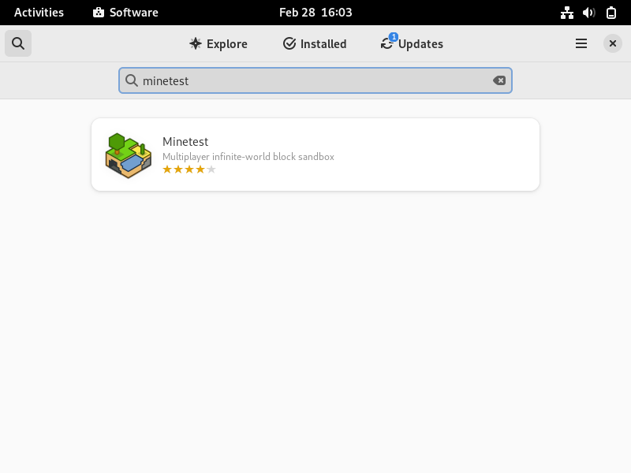
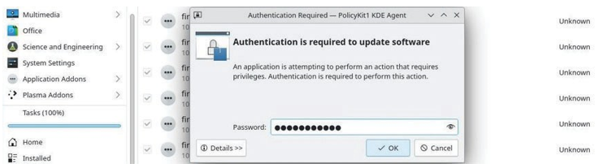

<style>
    @import url('https://fonts.googleapis.com/css2?family=Nunito&display=swap');
    :root {
        
    }
    h1 {
        text-align: center;
        font-family: 'Nunito', sans-serif;
        margin-top: -10px;
    }
    h3 {
        font-family: 'Nunito', sans-serif;
        margin-top: -15px;
    }
    p {
        font-family: 'Nunito', sans-serif;
        line-height: 1.2;
        font-size: 20px;
    }
    ul {
        font-size: 20px;
    }
</style>

# ✨ Administrasi Sistem ✨
### by:
* Mayada Azizah (3122500015)
* Adinda Zahra Qariru (3122500020)
* Masyitha Fahra Nabila (3122500023)

--- 

# 🔍 The Software Sources 🔍
### 1. Berkas sources.list
   Berkas penting dalam sistem berbasis Debian. Berisi daftar repositori tempat paket dapat diambil.
   - Lokasi:
     Biasanya ditemukan di `/etc/apt/sources.list`
   - Syntax:
     Setiap entri repositori terdiri dari URL diikuti oleh parameter tertentu, contoh:
```
    deb http://archive.ubuntu.com/ubuntu/ focal main restricted
    deb-src http://archive.ubuntu.com/ubuntu/ focal main restricted
```
### 2. Repositories, branches and sections/components
   - Repositories
     Server yang berisi paket untuk instalasi. `deb` atau `deb-src` URL sections/components
   - Branches (Cabang)
     Biasanya dicantumkan dalam URL repo (misalnya; `focal`, `buster`)
   - Sections or Components
     Terdapat setelah URL repositori (misalnya; `main`, `restricted`, `universe`, `multiverse`)

---

# 🔍 The Software Sources 🔍
### 3. Paket Backport
   - Definisi:
     Paket dari versi terbaru distribusi, dibuat untuk berfungsi di versi lama. Berguna untuk mengakses perangkat lunak terbaru tanpa mengupgrade seluruh sistem.
   - Penggunaan:
     Ditambahkan ke dalam berkas `sources.list` dengan repositori yang sesuai.
```
     deb http://archive.ubuntu.com/ubuntu/ focal-backports main restricted
     deb-src http://archive.ubuntu.com/ubuntu/ focal-backports main restricted
```
### 4. Memodifikasi repositori
   - Menambah Repositori:
     Buka `/etc/apt/sources.list` atau tambahkan berkas baru di `/etc/apt/sources.list.d/` dengan sintaks yang sama seperti di atas.
   - Menghapus Repositori:
     Hapus atau beri tanda komentar (`#`) pada baris yang sesuai di `sources.list.`
   - Refreshing Repositori:
     Gunakan perintah `sudo apt update` untuk memperbarui daftar paket dari repositori.

---

# ⚠️ APT in a Terminal ⚠️
### Perintah `User` dan `Administrator` untuk APT  
| Perintah                        | Deskripsi                                       |
|---------------------------------|-------------------------------------------------|
| `apt search <nama_paket>`       | Pencarian paket untuk informasi                 |
| `apt show <nama_paket>`         | Tampilan informasi tentang paket                |
| `sudo apt install <nama_paket>` | Instalasi paket                                 |
| `sudo apt update`               | Pembaruan daftar paket                          |
| `sudo apt upgrade`              | Pemutakhiran paket                              |
| `sudo apt autoremove`           | Pembersihan paket yang tidak digunakan          |
| `sudo apt dist-upgrade`         | Pemutakhiran distribusi utuh                    |

- APT (Advanced Package Tool) adalah alat manajemen paket yang kuat untuk distribusi Linux berbasis Debian.
- Mode `user` dan `administrator` dari APT memberikan kemudahan dalam penggunaan sehari-hari dan pemeliharaan sistem.

---

# 👩‍💻 Software: 
### Simplified Package Manager
Software adalah manajer aplikasi yang disederhanakan untuk distribusi Debian. Dengan Software, kita dapat mencari, menginstal, menghapus, atau memperbarui paket yang berisi aplikasi-aplikasi. Dapat ditemukan dalam kategori "Sistem" dari menu atau langsung dari kotak pencarian Gnome dengan mengetikkan "Software"
# 

---

### Software: Mencari Aplikasi
- Mencari aplikasi dengan mudah menggunakan antarmuka yang ramah pengguna.
- Cukup ketikkan nama aplikasi yang ingin ditemukan dan Software akan mencarikannya.
# 

---

### Software: Menginstal Aplikasi
- Instal aplikasi hanya dengan beberapa klik. Temukan aplikasi yang  diinginkan, klik "Install", dan biarkan Software menangani sisanya.
# 
# 

---

### Software: Menghapus Aplikasi
- Hapus aplikasi yang tidak lagi diperlukan tanpa repot.
- Cukup cari aplikasi yang ingin dihapus, klik "Remove", dan Software akan menghapusnya
# 

---

### Software: Memperbarui Aplikasi 
- Pastikan aplikasi selalu terbaru dengan mudah.
- Software akan memberi tahu ketika ada pembaruan tersedia dan memperbarui aplikasi dengan cepat.
# 

---

### Software: Modifikasi Repositori Paket
- Sesuaikan sumber paket untuk menambahkan atau menghapus repositori.
- Dapat disesuaikan pada pengaturan repositori langsung dari antarmuka Software.
# 
# 

---

### Software: Pembaruan Otomatis
- Hindari kesulitan dengan pembaruan otomatis. Aktifkan opsi pembaruan otomatis untuk memastikan sistem tetap terupdate otomatis.
# 
# 

---

# Discover: The KDE Package Manager
- Gnome menggunakan "Software" untuk menguruskan aplikasi secara mudah, manakala KDE mengintegrasikan Discover, sebuah program yang intuitif dan cekap. Discover membolehkan anda mencari, memasang, mengeluarkan, atau mengemas kini aplikasi anda dari antara muka tunggal.
- Discover diluncurkan hanya dari
``` 
menu utama KDE > Aplikasi> Sistem > Pusat Perangkat Lunak
```
---

### 1. Search and Install with Discover
- Discover memungkinkan Anda menambahkan komponen tambahan ke lingkungan Plasma Anda. Untuk melakukannya, kunjungi bagian "Tambahkan Plasma-ons".


---

### 2. Uninstalling an application with Discover
- Dengan Discover,kunjungi kategori “Terpasang” lalu klik “Hapus”:

### 3. Discover: updating your applications
- Saat KDE memberi tahu tentang pembaruan, “Temukan”-lah yang melaksanakannya. Klik tombol khusus (secara manual):

- Klik “Perbarui semua”, konfirmasi dengan kata sandi administrator.

---


```
Begitu pula dengan manajemen perangkat lunak, Anda dapat mengikuti prosesnya di dalam area notifikasi KDE.
```

---

### 4. Discover: managing repositories
- Pustaka perangkat lunak KDE memungkinkan Anda mengubah sumber aplikasi Anda tanpa menggunakan terminal. Buka bagian “Pengaturan” di Discover, entri menampilkan alamat repositori dari sumber.list Anda:


---

# Synaptic: The Comprehensive Package Manager
- Synaptic adalah antarmuka grafis komprehensif dari pengurus paket Debian. Ini membolehkan pandangan keseluruhan terhadap paket yang dicadangkan, sama ada dipasang atau tidak. Ini jauh lebih terperinci daripada Discover kerana menampilkan set penuh paket yang tersedia (termasuk perpustakaan).
    - Sypnatic menyediakan fungsi yang sama seperti apt.
    - Anda perlu memasukkan kata laluan pentadbir untuk membuka dan menggunakan Synaptic.
    - Sambungan Internet yang aktif juga diperlukan untuk memasang atau mengemas kini perisian 

---

### 1. Synaptic: Main interface
- Jendela Synaptic dibagi menjadi 4 area: toolbar di bagian atas, panel kiri yang memungkinkan berbagai cara penyortiran dan pemilihan paket, panel tengah yang menampilkan daftar paket itu sendiri, dan di bawahnya, panel yang menampilkan deskripsi paket yang saat ini dipilih (pemilihan dilakukan dengan mengklik).
- Di depan setiap paket, Anda akan melihat sebuah kotak kecil (putih untuk paket yang belum dipasang, hijau ketika dipasang, merah ketika rusak). Di sebelah kotak status ini, logo Debian menunjukkan bahwa paket ini "bebas" (sebagai kebebasan).
- Hal pertama yang harus dilakukan ketika Anda meluncurkan Synaptic adalah mengklik tombol "Muat Ulang" untuk memperbarui semua informasi (metadata) tentang repositori, paket, dan aplikasi yang tersedia.


---

### 2. Managing the repositories with Synaptic
- Repositori membolehkan anda mengemas kini dan memasang paket tambahan.
- Repositori telah dikonfigurasi semasa proses pemasangan tetapi anda boleh mengurusnya. Buka pengurus pakek Synaptic (menu Sistem > Pengurus pakej Synaptic). Di bar menu atas, klik pada "Tetapan," dan kemudian "Repositori".

- Sekarang, Anda dapat memodifikasi sumber repositori sesuka Anda. Cukup klik pada sumber untuk memodifikasinya, atau pada tombol “Baru” untuk menambahkan sumber lain.
- Setelah modifikasi Anda divalidasi, aplikasi akan mengundang Anda untuk memuat ulang daftar repositori agar perubahan Anda dapat diperhitungkan.

---

### 3. Updating the system with Synaptic
- Sebelum memperbarui sistem, perlu untuk “Muat Ulang” daftar paket, dengan masuk ke menu “Edit > Muat Ulang Informasi Paket” (atau bahkan [Ctrl]+r jika Anda ingin menggunakan pintasan keyboard). Tindakan ini memeriksa apakah versi paket yang ada di sistem Anda adalah yang terbaru atau tidak.
- Kemudian klik "Tandai Semua Pembaruan", jika tidak ada yang terjadi setelah Anda mengklik "Pembaruan Semua", ini berarti bahwa sistem Anda sudah terbaru. Jika ada paket yang tersedia untuk diinstal atau diperbarui, mereka akan disebutkan. Anda dapat melihatnya dengan memilih bagian "Status" > "diinstal (dapat diperbarui)": 

---

- Jendela baru muncul dengan daftar paket yang akan diperbarui serta dependensi tambahan.
- Hanya perlu mengklik tombol "Tambahkan ke seleksi" kemudian tombol "Terapkan", dan terima konfirmasi yang diminta:


- Proses pembaruan sistem dimulai dengan mengunduh paket-paketnya, dan dilanjutkan dengan instalasi.
- Sebuah pesan pemberitahuan bahwa semua perubahan telah diterapkan.

---

### 4.Searching for a software
- Jika Anda mengetahui nama paket atau jika Anda mencari sesuatu dengan tepat, klik tombol pencarian (di bilah atas) dan masukkan kata kunci pencarian Anda di jendela yang terbuka.

- Jika Anda tidak tahu nama paket yang Anda butuhkan, Anda dapat menyaring daftar menggunakan filter berdasarkan bagian, status, asal, dll.
Sebagai contoh, jika Anda mencari permainan, klik pada "Bagian" di bagian bawah panel kiri, gulir ke bawah ke bagian "Permainan dan Hiburan", klik di atasnya, dan semua paket yang berkaitan dengan permainan dan hiburan akan muncul di panel tengah.

---

### 5. Installing a package with Synaptic
- Klik kanan pada kotak kecil di depan nama paket, dan pilih opsi "Tandai untuk Instalasi"Untuk menginstal satu atau beberapa paket.

- Jika, untuk dapat berfungsi, paket ini memerlukan instalasi paket lain (dependensi), mereka secara otomatis ditambahkan ke dalam seleksi.
- Kemudian, klik tombol "Terapkan" dan konfirmasi ringkasan perubahan yang akan diterapkan.
- Paket-paket diunduh dan diinstal. Anda dapat mengikuti seluruh proses tersebut dalam antarmuka Synaptic:
```
   Terkadang kita ingin menginstal ulang paket yang sudah terpasang.
   Dalam hal itu, pilih opsi "Tandai untuk Instalasi Ulang". 
   Ini memungkinkan, misalnya, untuk mengembalikan konfigurasi default
   aplikasi jika Anda telah memodifikasinya.
```

---

### 6. Uninstall a package with Synaptic
- Klik kanan pada kotak kecil di depan nama paket, dan pilih opsi "Tandai untuk Penghapusan". Kemudian klik "Terapkan".
- Penghapusan sederhana menjaga file konfigurasi paket di sistem Anda, jika Anda ingin menginstal ulang nanti. 
- Pilih opsi "Tandai untuk Penghapusan Lengkap" untuk menghapus juga file konfigurasi.
    - Synaptic: cleaning useless packages
        - Ketika Synaptic diluncurkan, klik tombol "Status" di bagian bawah panel kiri. Jika kategori "Terinstal (Dapat dihapus secara otomatis)" muncul.
        - Selanjutnya, klik kanan pada setiap paket di panel tengah, dan pilih opsi "Tandai untuk Penghapusan Lengkap". Setelah semua paket ditandai, klik tombol "Terapkan".
    - Removing configuration residues
        - Klik tombol "Status" di bagian bawah panel kiri. Jika kategori "Tidak terpasang (konfigurasi sisa)" muncul, pilihlah itu.
        - Selanjutnya, klik kanan pada setiap paket di panel tengah, dan pilih opsi "Tandai untuk Penghapusan Lengkap". Setelah semua paket ditandai, klik tombol "Terapkan".

---

### 7. Look at detailed information on a package
- Klik pada paket, deskripsi paket tersebut akan ditampilkan di panel tengah bawah Synaptic. Untuk mendapatkan informasi lebih lanjut tentang sebuah paket, klik kanan pada paket tersebut, dan pilih Properti, atau pergi ke menu "Paket > Properti". Kemudian Anda akan mengetahui segala sesuatu tentang paket ini: dependensi, file yang diinstal, ukuran, dan versi.
### 8. Synaptic preferences
- "Preferences" adalah kategori yang sangat tepat, yang ada di sebagian besar aplikasi, namun, perlu diingat bahwa Synaptic mengelola seluruh perangkat lunak yang terpasang di sistem Anda. Ketika Anda menghapus sebuah program, itu tidak masuk ke tempat sampah.


---

- Umum: Opsi di sini cukup eksplisit. Anda dapat membatalkan centang opsi "Pertimbangkan paket yang direkomendasikan sebagai dependensi", jika itu membantu Anda menjaga sistem yang sangat ringan. Namun, hal ini bisa menyebabkan masalah saat menginstal paket baru di masa depan. Oleh karena itu, pilihan ini harus ditangani dengan hati-hati.
- Kolom dan Font: Memungkinkan Anda untuk menampilkan/menyembunyikan beberapa kolom dalam daftar paket, dan menentukan font, jika diperlukan.
- Warna: Anda dapat menentukan di sini warna paket sesuai dengan statusnya.
- Berkas: Ketika Anda menginstal sebuah perangkat lunak, itu pertama kali disimpan di cache (yang merupakan folder khusus dalam sistem file) sebelum dikompres dan diinstal. Paket-paket ini dapat mengambil lebih banyak ruang disk seiring Anda menggunakan komputer Anda. Di sini, Anda dapat menghapusnya secara langsung atau mengkonfigurasi tindakan otomatis.
- Jaringan: Ini adalah cara Synaptic terhubung ke Internet. Anda harus mengetahui apakah situasi Anda memerlukan modifikasi parameter-parameter ini.
- Distribusi: Menentukan perilaku pembaruan paket dan sangat eksplisit. Jika ragu, jangan mengubahnya!
```
Ingatlah: dengan menggunakan terminal Anda dapat mencapai hasil yang 
sama lebih cepat dan dengan manipulasi yang lebih sedikit.
```

---

# Cleaning the system
Meskipun kapasitas hard disk meningkat secara dramatis selama beberapa tahun terakhir, Anda mungkin membutuhkan beberapa ruang kosong. Beberapa skrip mengotomatisasi proses pembersihan disk.
### 1. Disk space information
Hal pertama yang harus dilakukan adalah mengetahui ruang yang digunakan pada disk Anda. Beberapa alat tersedia untuk Anda, mulai dari terminal Anda:
- Ruang disk dalam mode terminal
Ringkasan penggunaan ruang disk untuk setiap titik pemasangan sistem (disk dan partisi) dengan perintah df:

- Buat daftar repertori Anda yang diurutkan berdasarkan ukuran yang diperkecil
Tampilkan direktori Anda yang berat menggunakan du dan sort:


---

- Ncdu
Sebuah analisis ruang disk dalam mode konsol. Untuk menjalankannya, cukup ketik "ncdu" di terminal Anda. Untuk menginstal perangkat lunak ini (dalam mode administrator):

- Baobab
Sebuah analisis ruang disk dalam mode grafis, terintegrasi dalam Gnome tetapi tersedia dalam lingkungan lain dengan:


---

### 2. Cleaning the packages
- Apt/aptitude/dpkg adalah pengelola paket Debian yang biasa digunakan. Saat Anda menginstal sebuah paket, berkas arsip-sumber/deb-nya disimpan di sistem Anda (di folder /var/cache/apt/archives/) untuk memungkinkan penginstalan ulang tanpa koneksi Internet. Untuk membersihkan "cache apt", gunakan perintah sederhana dalam mode administrator:

- Setelah cache paket yang terinstal dibersihkan, Anda juga dapat menghapus paket-paket yang tidak berguna dari sistem Anda, serta file konfigurasi. Peringatan! Ingatlah untuk memeriksa dengan cermat daftar paket yang direncanakan untuk dihapus, sebelum menerima operasi tersebut:

- Jika Anda telah mengupgrade sistem Anda, mungkin ada beberapa paket yang tidak lagi tersedia di repositori baru: mereka sudah usang. Untuk menampilkan dan menghapus paket-paket ini, gunakan apt dan ingatlah untuk memeriksa dengan cermat daftar paket yang direncanakan untuk dihapus:


---

- Akhirnya, untuk menampilkan dan membersihkan file konfigurasi yang tetap berada meskipun aplikasi telah dihapus, Anda dapat menggunakan perintah-perintah ini:

- Bagi yang lebih peduli dengan kebersihan sistem, Anda dapat menginstal alat deborphan yang mencatat paket-paket yatim piatu di sistem Anda: yaitu, paket-paket yang tidak ada paket lain yang bergantung padanya. 
```
  Peringatan! Ingatlah untuk memeriksa dengan cermat 
  daftar paket yang direncanakan untuk dihapus, sebelum 
  menerima operasi tersebut.
```


---
### 3. Emptying the trash bins
- Ada tiga tempat sampah yang berbeda yang harus diperhatikan:
    - Tempat sampah pengguna: ~/.local/share/Trash/ . Anda dapat mengosongkannya dengan manajer file sistem (bab 3.6.2.5), atau dengan terminal:
    
    - Tempat sampah administrator: /root/.local/share/Trash/. Untuk mengosongkannya dengan benar, gunakan terminal dalam mode administrator:
    
    - Tempat sampah eksternal: terletak di disk eksternal Anda, biasanya dinamai '/media/y- our_id/your_disk/.Trash_1000', di mana your_id sesuai dengan nama login Anda.

---
### 4. Purging application caches
- Beberapa aplikasi menggunakan folder "cache", dimana mereka menyimpan gambar, video, dan informasi lainnya untuk berjalan lebih cepat. Biasanya data ini tidak menghabiskan terlalu banyak ruang disk, namun jika (dengan menggunakan alat yang dijelaskan di atas) Anda mendeteksi bahwa sebuah folder menjadi terlalu besar, jangan ragu untuk menghapusnya.

- Setiap aplikasi memiliki cara tersendiri untuk mengelola cache-nya: beberapa menghapusnya secara sistematis saat mereka ditutup, yang lain menyimpan datanya di folder /tmp, yang akan dibersihkan saat logout sesi, yang lain menyimpan semua informasinya di folder tertentu.
### 5. Purging the thumbnails
- Masalah muncul ketika Anda menghapus sebuah file grafis, karena thumbnail-nya tetap disimpan dalam sistem, dan hal ini mengakibatkan sejumlah ruang disk terbuang untuk menyimpan thumbnail yang usang. 

```Folder ini akan dibuat kembali saat sistem perlu menyimpan thumbnail yang baru dibuat.```

---

# Installing external `.deb` packages
### 1. Installation in graphic mode with GDebi
- Untuk menginstalnya, cari `gdebi` di manajer paket favorit (Synaptic, Discover, Software) atau lebih mudah lagi dari terminal dengan mode administrator menggunakan `su` (bab 3.8.3):
```
apt update && apt install gdebi
```
- Ketika mengunduh paket eksternal Debian, klik kanan pada paket dan pilih "Buka dengan gdebi".
- Dalam menu, klik File > Buka dan masukkan jalur file `.deb`
- Kemudian klik "Pasang Paket". Password diminta untuk validasi instalasi.
- Untuk menghapusnya cukup klik "Hapus Paket".

---

# Installing external `.deb` packages
### 2. Installation in terminal mode with `Dpkg`
Dpkg adalah utilitas perangkat lunak yang menangani paket, seperti halnya apt, tetapi tanpa mengelola dependensi.

Menginstal Paket Eksternal:
```
dpkg -i nama_paket.deb
```

Pesan kesalahan akan memberi tahu jika ada dependensi yang hilang. Kemudian cukup instal dependensi tersebut dengan menggunakan apt:
```
apt install dependensi_1 dependensi_2 ...
```

Kemudian jalankan kembali instalasi paket eksternal:
```
dpkg -i nama_paket.deb
```

Untuk menghapus paket eksternal:
```
dpkg --purge nama_paket
```

---

# Installing Flatpak applications
Flatpak adalah sistem aplikasi virtualisasi untuk GNU/Linux. Ini menyediakan lingkungan `sandbox` aman di mana pengguna dapat menjalankan aplikasi yang tidak divalidasi oleh repositori distribusi resmi. Dengan `flatpak`, dapat menjalankan aplikasi uji coba atau versi terbaru tanpa risiko merusak sistem utama.

### 1. Installing Flatpak
Untuk menggunakan aplikasi dalam format `flatpak`, Anda harus menginstal paket yang sesuai terlebih dahulu. Dari terminal dalam mode administrator:
```
apt install flatpak
```
Setelah itu, dapat mengunduh dan menginstal paket-paket flatpak melalui situs seperti Flathub (https://flathub.org/home). Cara paling sederhana adalah dengan menambahkan repositori ke sumber untuk mendapatkan daftar lengkap aplikasi tanpa harus mencari melalui situs.

---

# Installing Flatpak applications
### 2. Add a Flatpak repository
Untuk menambahkan repositori seperti Flathub dan mendapatkan pencarian yang mudah serta instalasi yang disederhanakan, ketik di terminal:
```
flatpak remote-add flathub https://flathub.org/repo/flathub.flatpakrepo
```
Setelah itu, akan diminta kata sandi administrator. Dan perlu me-restart sistem Anda agar perubahan dapat berlaku.

---

# Installing Flatpak applications
### 3. Manage Flatpak applications under Gnome with Software  
Untuk mengelola aplikasi Flatpak melalui manajer perangkat lunak, diperlukan menambahkan plugin yang sesuai dengan environment. Untuk Gnome dan manajer perangkat lunaknya yang disederhanakan, di terminal dan dalam mode administrator:

```
apt install gnome-software-plugin-flatpak
```
Setelah itu, dapat mengelola aplikasi Flatpak seperti halnya aplikasi lainnya. Perhatikan indikator sumber perangkat lunak di bagian bawah deskripsi.

Seperti halnya dengan aplikasi lain, kata sandi administrator akan diminta untuk setiap instalasi. Aplikasi akan langsung tersedia di menu aplikasi.

---

# Installing Flatpak applications
### 4. Manage Flatpak applications under KDE with Discover
Untuk mengelola aplikasi Flatpak melalui Discover di KDE, perlu menginstal plugin yang sesuai. Di terminal dalam mode administrator:
```
apt install plasma-discover-backend-flatpak
```
Setelah itu, dapat mengelola aplikasi Flatpak seperti halnya aplikasi lainnya. Saat mencari, harus mengklik file perangkat lunak. Jangan langsung klik "Pasang" karena repositori Debian memiliki prioritas.

Pilih repositori flathub dari menu "Sumber" di Discover. Kemudian mulai instalasi dengan mengklik "Pasang":

Seperti halnya dengan aplikasi lain, kata sandi administrator akan diminta untuk setiap instalasi. Aplikasi akan langsung tersedia di menu aplikasi.

---

# Installing Flatpak applications
### 5. Installing Flatpak applications
Berikut beberapa perintah dasar untuk mengelola flatpak dari terminal:

| Perintah                        | Deskripsi                                       |
|---------------------------------|-------------------------------------------------|
| flatpak search flatpak_name     | Mencari flatpak                 |
| flatpak install repository flatpak_name         | Menginstal flatpak dari repositori                |
| flatpak uninstall flatpak_name | Menghapus flatpak                                 |
| flatpak uninstall --unused               | Menghapus dependensi yang tidak terpakai                          |
| flatpak update              | Memperbarui semua flatpak yang terinstal                              |
| flatpak run flatpak_name           | Menjalankan flatpak          |

instal flatpak hanya untuk pengguna saat ini dengan opsi "--user". File akan ditempatkan dalam direktori pengguna ($HOME/.local/share/flatpak/).
```
flatpak --user install repository nama_flatpak
```

---

# Installing Flatpak applications
### 6. Remove a Flatpak application
Jika telah menginstal flatpak secara grafis melalui Software atau Discover, cukup hapus dari menu aplikasi yang terinstal dari manajer perangkat lunak: cari flatpak yang ingin dihapus lalu mulai penghapusan dari tombol yang ditunjuk.

Perhatikan bahwa jika ingin menghapus semua dependensi (perangkat lunak yang diinstal tambahan selain flatpak untuk operasinya), perlu menjalankan perintah berikut di terminal:
```
ftatpak uninstatt --unused
```

---

# Installing Flatpak applications
### 7. Some Flatpak repositories
untuk menghindari kesalahan yang dihasilkan oleh duplikat dapat menggunakan opsi "--if-no-exists".
- Flathub repository (https://flathub.org/) - menyediakan banyak aplikasi:
```
flatpak remote-add flathub https://flathub.org/repo/flathub.flatpakrepo
```
- KDE Flatpak repository:
```
flatpak remote-add kdeapps https://distribute.kde.org/kdeapps.flatpakrepo
```
- Gnome-nightly Flatpak repository:
```
flatpak remote-add gnome-nightly https://nightly.gnome.org/gnome-nightly.flatpakrepo
```
Dengan menambahkan repositori ini, sehingga dapat memiliki akses ke lebih banyak aplikasi dalam format Flatpak untuk diinstal dan digunakan dalam sistem.

---
# Who is this Sid guy?
Ada beberapa cabang distribusi Debian yang ada secara bersamaan:

- Stable: Distribusi resmi Debian, yang dikeluarkan saat ini, hanya menerima pembaruan keamanan dan perbaikan bug. Direkomendasikan untuk digunakan.
- Oldstable: Versi stabil sebelumnya, umumnya didukung oleh tim Debian selama satu tahun setelah rilis versi baru. Jika masih banyak yang menjaga, bisa jadi LTS (Long Term Support).
= Testing: Versi yang akan menjadi Stable berikutnya. Dipersiapkan untuk versi stabil berikutnya dan menjadi resmi setelah dianggap siap dan telah melalui masa pembekuan perangkat lunak.
- Unstable (Sid): Versi yang menerima semua pembaruan paket baru, menjadi pusat inovasi, namun tidak sangat stabil. Digunakan oleh beberapa pengguna yang suka eksperimen.
- Experimental: Bukan distribusi Debian resmi, melainkan tempat di mana versi perangkat lunak alpha atau beta diuji.

---
# 🥳 Thank you! 
