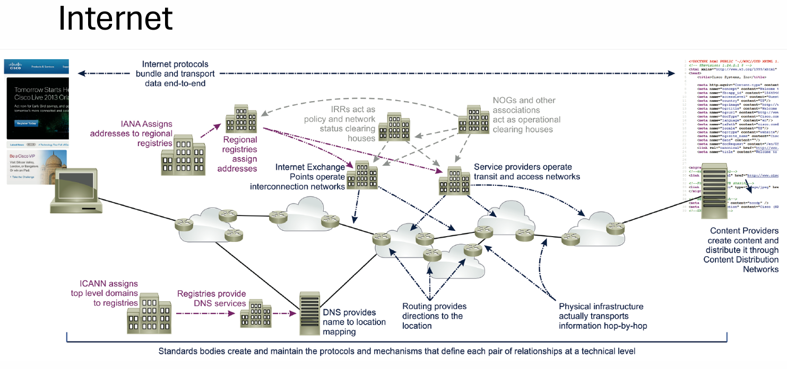

<h1 align="center">LAPORAN WORKSHOP ADMINISTRASI JARINGAN</h1>

<h3 align="center">TUGAS 4</h3>

<h4 align="center">Dosen Pembimbing: Dr. Ferry Astika Saputra ST, M.Sc</h4>

<p align="center"></p>

<div align="center">
  <h3>Disusun Oleh:</h3>
  <p align="center">Mayada Azizah 3122500015</p>
</div>

<div align="center">
  <h3>PROGRAM STUDI TEKNIK INFORMATIKA <br>
      POLITEKNIK ELEKTRONIKA NEGERI SURABAYA <br>
      TAHUN 2023/2024 <br>
  </h3>
</div>

---

## 1. Ekosistem Internet

<div align="center">
    <br>
    <em style="font-size:10px">Gambar 1. Ekosistem Internet</em>
</div><br>

<div align="justify">
<span style="font-size:14px">
Ekosistem internet adalah jaringan kompleks yang terdiri dari berbagai organisasi, teknologi, dan individu. Interaksi dan aliran data antara berbagai komponen memungkinkan internet untuk berfungsi dan berkembang.

<br/><br/>
Organisasi:

- <b>IANA (Internet Assigned Numbers Authority):</b> Mengelola alamat IP dan nama domain global.
- <b>ICANN (Internet Corporation for Assigned Names and Numbers):</b> Bertanggung jawab atas koordinasi sistem nama domain (DNS).
- <b>IETF (Internet Engineering Task Force):</b> Mengembangkan standar internet dan protokol baru.
W3C (World Wide Web Consortium): Membangun standar web untuk interoperabilitas dan aksesibilitas.
- <b>ITU-T (International Telecommunication Union - Telecommunication Standardization Sector):</b> Menetapkan standar telekomunikasi global.
- <b>Organisasi Regional dan Pemerintah:</b> Menetapkan kebijakan dan regulasi internet di wilayah masing-masing.
</span>
</div>

---

### Internet

<div align="center">
    <br>
    <em style="font-size:10px">Gambar 2. Internet</em>
</div><br>

<div align="justify">
<span style="font-size:14px">
 internet adalah jaringan komputer global yang memungkinkan orang untuk berkomunikasi satu sama lain. Internet terdiri dari jaringan komputer yang saling terhubung. Jaringan ini menggunakan protokol internet untuk mengirimkan data antar komputer. Protokol ini adalah aturan yang memungkinkan komputer berkomunikasi satu sama lain.

Internet juga mencakup organisasi lain yang membantu mengelola dan memelihara internet. Organisasi-organisasi ini termasuk IANA (Internet Assigned Numbers Authority), ICANN (Internet Corporation for Assigned Names and Numbers), dan IETF (Internet Engineering Task Force).

Organisasi ini bekerja sama untuk memastikan internet berfungsi dengan lancar dan efisien. Misalnya, IANA bertanggung jawab atas penetapan alamat IP, yang merupakan alamat unik yang diberikan ke setiap perangkat di internet. ICANN bertanggung jawab atas koordinasi sistem nama domain (DNS), yang menerjemahkan nama domain yang mudah dibaca manusia (seperti [invalid URL removed]) ke alamat IP numerik. IETF mengembangkan standar internet baru, seperti protokol dan prosedur, untuk memastikan interoperabilitas antar jaringan.

<br>
<b> Internet dapat dipandang dari 2 sisi: </b>

Sisi Teknis:

- Routing system: Sistem ini menentukan rute terbaik untuk paket data yang dikirim melalui internet. Hal ini melibatkan jaringan router yang saling terhubung dan berkomunikasi untuk menentukan jalur yang paling efisien.
- Naming system: Sistem ini digunakan untuk memberi nama dan alamat pada perangkat dan sumber daya di internet. Hal ini memungkinkan pengguna untuk mengakses situs web, server email, dan layanan online lainnya dengan mudah.

Sisi Arsitektur:

- Standards: Standarisasi memastikan bahwa semua perangkat dan jaringan di internet dapat berkomunikasi satu sama lain. Hal ini mencakup protokol komunikasi, format data, dan metode keamanan.
- Service Providers: Penyedia layanan menyediakan akses internet kepada pengguna dan bisnis. Mereka dapat berupa perusahaan telekomunikasi, penyedia layanan internet (ISP), atau operator seluler.
- Internet Registries: Registri internet bertanggung jawab untuk mengelola alamat IP dan nama domain. Hal ini memastikan bahwa setiap perangkat dan situs web memiliki alamat yang unik dan dapat diidentifikasi.
- Clearing Houses: Rumah kliring memfasilitasi pertukaran data dan informasi antara berbagai jaringan dan penyedia layanan.
</span>

---

### IP Addressing & Routing System

Bayangkan internet sebagai jalan raya besar yang menghubungkan kota-kota (perangkat) di seluruh dunia. Untuk memastikan paket data (informasi) sampai ke tujuan yang tepat, membutuhkan dua sistem penting: IP Addressing dan Routing System.

- IP Addressing (Pengalamatan IP): Seperti sistem penomoran rumah di jalan raya. Setiap perangkat yang terhubung ke internet memiliki alamat IP unik yang berfungsi sebagai pengenal online-nya. Alamat IP terdiri dari serangkaian angka yang dipisahkan titik (misalnya, 192.168.1.1).

- Routing System (Sistem Routing): Seperti petugas navigasi di jalan raya. Router adalah perangkat jaringan yang membaca alamat IP tujuan pada paket data dan menentukan jalur terbaik untuk mengirimkannya. Router terhubung satu sama lain, membentuk jaringan besar yang saling bertukar informasi tentang rute terbaik ke berbagai alamat IP.

Sistem IP Addressing dan Routing bergantung pada protokol yang disetujui secara global, seperti TCP/IP (Transmission Control Protocol/Internet Protocol). Protokol ini memastikan bahwa paket data dipecah menjadi ukuran yang tepat, dialamatkan dengan benar, dan dikirimkan dengan andal.

#### Peering Connections:
Peering adalah kesepakatan antara dua penyedia layanan internet (ISP) untuk saling bertukar lalu lintas internet secara langsung di titik temu jaringan (internet exchange point - IXP). Koneksi peering mengurangi biaya dan meningkatkan kecepatan transfer data karena lalu lintas tidak perlu melewati jaringan perantara.

#### Routing Policy:
Kebijakan routing mengontrol bagaimana router memilih jalur untuk meneruskan paket data. Bergantung pada jenis penyedia layanan internet, ada beberapa kebijakan routing yang berbeda:
- Edge Provider Routing Policy: Kebijakan yang diterapkan oleh ISP yang berfokus pada pengguna akhir (seperti Anda di rumah). Biasanya memprioritaskan stabilitas, keamanan, dan pengalaman pengguna yang baik.
- Transit Provider Routing Policy: Kebijakan yang diterapkan oleh ISP yang menjual akses internet ke ISP lain. Biasanya memprioritaskan efisiensi biaya dan kapasitas jaringan.
- Content Provider Routing Policy: Kebijakan yang diterapkan oleh penyedia konten (seperti platform streaming video). Biasanya memprioritaskan kinerja tinggi dan pengiriman konten yang lancar.

---
### Domain Name System (DNS)

DNS, atau Domain Name System (Sistem Penamaan Domain), adalah interaksi antar komputer yang terhubung lewat server dengan saling mengenali IP Address (tanda pengenal). Sistem pada Domain Name Server akan mengubah URL website menjadi IP Address secara ringkas, sehingga pengguna tidak direpotkan untuk mengetik IP Address manual ketika ingin mengunjungi suatu halaman.

Gambarannya, seperti jika ingin mengakses laman Google, tanpa DNS, perlu mengetikkan 172.217.0.142 ke dalam address bar. Domain Name Server akan mempersingkat dengan hanya mengetikkan alamat Google.com.

---
## Bagaimana Internet Bekerja?

Ketika seseorang mengakses internet, permintaan data dari perangkat klien mereka, seperti komputer atau smartphone, dikirim melalui jaringan ISP (Internet Service Provider) mereka. ISP bertindak sebagai penghubung utama antara klien dan internet secara keseluruhan. Proses ini bergantung pada standar protokol yang dikembangkan oleh IETF, seperti TCP/IP, yang memastikan pengiriman data yang andal dan efisien.

Saat permintaan data mencapai ISP, mereka menggunakan sistem alamat IP yang dikelola oleh IANA untuk mengarahkan permintaan tersebut ke server yang sesuai. IANA bertanggung jawab atas pengelolaan alamat IP dan pengelolaan basis data global yang menghubungkan alamat IP dengan lokasi dan identitas perangkat.

Selanjutnya, dalam perjalanan data dari perangkat klien menuju server yang diminta, data tersebut melewati serangkaian router. Router adalah perangkat yang memutuskan rute terbaik untuk data berdasarkan alamat IP tujuan. Proses ini disebut routing, dan ini memastikan bahwa data sampai ke tujuannya dengan efisien melalui jaringan yang kompleks.

Ketika data mencapai server yang diminta, protokol dan standar yang dikembangkan oleh IETF memastikan bahwa data tersebut dapat diakses dan diinterpretasikan dengan konsisten. W3C, yang bertanggung jawab atas pembuatan standar web, berperan dalam memastikan bahwa konten web dapat diakses dengan mudah dan konsisten oleh berbagai perangkat dan platform.

Selanjutnya, DNS (Domain Name System) juga berperan penting dalam proses ini. Ketika seseorang memasukkan nama domain ke dalam browser web mereka, DNS bekerja untuk menerjemahkan nama domain tersebut menjadi alamat IP yang sesuai, menggunakan informasi yang dikelola oleh IANA. Hal ini memungkinkan perangkat klien untuk menemukan dan terhubung dengan server yang diinginkan menggunakan nama domain yang lebih mudah diingat daripada alamat IP numerik.

Selain itu, ITU-T menetapkan standar telekomunikasi global yang dapat mempengaruhi infrastruktur dan teknologi yang digunakan dalam penyediaan layanan internet di seluruh dunia. Organisasi regional dan pemerintah memiliki peran dalam menetapkan kebijakan dan regulasi internet di wilayah masing-masing, yang dapat memengaruhi cara internet diatur, dikelola, dan diakses.

---
## 2. Bagaimana cara kerja dari iterative dan recursive dari DNS Query, ada 8 step, dari PC anda! misal akses detik.com

<div align="center">
    <br>
    <em style="font-size:10px">Gambar 3. DNS Query (Sumber: cloudflare.com)</em>
</div><br>

<b> Langkah 1 </b>: Mengetikkan alamat website "detik.com" di browser.

<b> Langkah 2 </b>: Komputer Anda tidak mengetahui alamat IP "detik.com", sehingga ia mengirimkan permintaan (query) ke resolver DNS lokal.

<b> Langkah 3 </b>:
- Iterative query: Resolver DNS lokal tidak memiliki informasi tentang "detik.com".
- Recursive query: Resolver DNS lokal tidak langsung mencari informasi tentang "detik.com".

<b> Langkah 4 </b>:
- Iterative query: Resolver DNS lokal mengirimkan query ke root server. Root server merespon dengan daftar TLD (Top-Level Domain) server.
- Recursive query: Resolver DNS lokal menghubungi authoritative name server untuk "detik.com" secara langsung. Authoritative name server merespon dengan alamat IP untuk "detik.com".

<b> Langkah 5 </b>:
- Iterative query: Resolver DNS lokal mengirimkan query ke .com TLD server.
<b>.com TLD server</b> merespon dengan daftar authoritative name server untuk "detik.com".
- Recursive query: (Tidak ada langkah 5 dalam recursive query karena resolver langsung mendapatkan alamat IP di langkah 4.)

<b> Langkah 6 </b>:
- Iterative query: Resolver DNS lokal mengirimkan query ke authoritative name server untuk "detik.com".
- Recursive query: (Langkah ini sudah dilakukan di langkah 4 pada recursive query.)

<b> Langkah 7 </b>:
- Iterative query: Authoritative name server merespon dengan alamat IP untuk "detik.com".
- Recursive query: (Langkah ini sudah dilakukan di langkah 4 pada recursive query.)

<b> Langkah 8 </b>:
- Iterative query: Resolver DNS lokal mengirimkan alamat IP ke komputer Anda.
- Recursive query: Resolver DNS lokal mengirimkan alamat IP ke komputer Anda. Komputer Anda kemudian terhubung ke website detik.com menggunakan alamat IP tersebut.

<b> Perbedaan Iterative dan Recursive Query: </b>
- Iterative query: Resolver DNS menyelesaikan query langkah demi langkah.
- Recursive query: Resolver DNS meminta server lain untuk menyelesaikan query.
Pada contoh di atas:

Langkah 4-7 pada iterative query menunjukkan bagaimana resolver DNS menyelesaikan query secara langkah demi langkah. Sedangkan Langkah 4 pada recursive query menunjukkan bagaimana resolver DNS meminta authoritative name server untuk menyelesaikan query.


## 3. instalasi DNS server
sumber : https://wiki.debian.org/Bind9#Debian_Bookworm

```
sudo apt install bind9 bind9-doc bind9-dnsutils 
```
<div align="center">
    <br>
    <em style="font-size:10px"></em>
</div><br>

```
cd /etc/bind
ls -al
```
<div align="center">
    <br>
    <em style="font-size:10px"></em>
</div><br>

```
sudo nano /etc/bind/named.conf
```
<div align="center">
    <br>
    <em style="font-size:10px"></em>
</div><br>

```
sudo nano /etc/bind/named.conf.default-zones
```
<div align="center">
    <br>
    <em style="font-size:10px"></em>
</div><br>

```
sudo nano /etc/bind/named.conf.options
```
<div align="center">
    <br>
    <em style="font-size:10px"></em>
</div><br>

```
sudo nano /etc/bind/named.conf.local
```
<div align="center">
    <br>
    <em style="font-size:10px"></em>
</div><br>

```
sudo named-checkconf /etc/bind/named.conf
```
<div align="center">
    <br>
    <em style="font-size:10px"></em>
</div><br>

```
pindah ke : cd /var/lib/bind/
sudo nano db.kelompok11.local
```
<div align="center">
    <br>
    <em style="font-size:10px"></em>
</div><br>

```
sudo named-checkzone kelompok10.local db.kelompok10.local
```
<div align="center">
    <br>
    <em style="font-size:10px"></em>
</div><br>

```
sudo nano db.kelompok10.local.inv
```
<div align="center">
    <br>
    <em style="font-size:10px"></em>
</div><br>

```
sudo named-checkzone 10.168.192.inaddr-arpa db.kelompok10.local.inv
```
<div align="center">
    <br>
    <em style="font-size:10px"></em>
</div><br>

```
sudo nano /etc/network/interfaces
```
<div align="center">
    <br>
    <em style="font-size:10px"></em>
</div><br>

```
sudo nano /etc/resolv.conf
```
<div align="center">
    <br>
    <em style="font-size:10px"></em>
</div><br>

```
sudo systemctl restart named
sudo systemctl status named
```
<div align="center">
    <br>
    <em style="font-size:10px"></em>
</div><br>

```
dig kelompok10.local
```
<div align="center">
    <br>
    <em style="font-size:10px"></em>
</div><br>

```
dig -x 192.168.10.1
```
<div align="center">
    <br>
    <em style="font-size:10px"></em>
</div><br>

```
nslookup ns
nslookup ns.kelompok10.local
```
<div align="center">
    <br>
    <em style="font-size:10px"></em>
</div><br>

```
nslookup 192.168.10.1
```
<div align="center">
    <br>
    <em style="font-size:10px"></em>
</div><br>
</div>
