

  <h1 style="text-align: center;">LAPORAN WORKSHOP ADMINISTRASI JARINGAN Tugas 6: Arsitektur web browser dan web server</h1>
  <h4 style="text-align: center;">Dosen Pengampu : Dr. Ferry Astika Saputra, S.T., M.Sc.</h4>

  <h3>Disusun Oleh:</h3>
  
Mayada Azizah 3122500015

  
Adinda Zahra Qariru 3122500020

  
Masyitha Fahra Nabila 3122500023

  <h3>PROGRAM STUDI TEKNIK INFORMATIKA  
      POLITEKNIK ELEKTRONIKA NEGERI SURABAYA  
      TAHUN 2023/2024  
  </h3>

#

## Web Browser(Client)

  

Gambar di atas menunjukkan arsitektur dari komponen utama sebuah web browser. Komponen-komponen ini bekerja bersama untuk memungkinkan pengguna mengakses dan berinteraksi dengan situs web.

- **User Interface**  
  User Interface (UI) adalah bagian dari browser yang langsung berinteraksi dengan pengguna. Ini mencakup elemen seperti bilah alamat, tombol, menu, dan tab. Antarmuka pengguna bertanggung jawab untuk mengambil masukan pengguna dan mengirimkannya ke mesin browser.
- **Browser Engine**  
  Browser Engine adalah "otak" dari browser. Ini bertanggung jawab untuk menginterpretasi masukan pengguna dan berkomunikasi dengan komponen browser lainnya. Mesin browser juga menangani tugas seperti mengelola riwayat dan bookmark, dan memproses cookie.
- **Rendering Engine**  
- Rendering Engine bertanggung jawab untuk mengambil kode HTML, CSS, dan JavaScript dari server web dan mengubahnya menjadi representasi visual yang dapat ditampilkan di layar pengguna. Mesin pemrosesan juga menangani tugas seperti tata letak dan lukisan.
- **Networking**  
  Komponen jaringan bertanggung jawab untuk mengirimkan dan menerima permintaan dari dan ke server web. Ini menggunakan protokol seperti HTTP dan HTTPS untuk mentransfer data
- **JavaScript Interpreter**  
  JavaScript Interpreter bertanggung jawab untuk mengeksekusi kode JavaScript yang tertanam dalam halaman web. JavaScript adalah bahasa skrip yang memungkinkan halaman web menjadi lebih interaktif dan dinamis.
- **UI Backend**  
  UI Backend bertanggung jawab untuk menggambar elemen antarmuka pengguna di layar. Ini menggunakan pustaka grafis sistem operasi untuk merender antarmuka pengguna.
- **Data Persistence**  
  Komponen Data Persistence bertanggung jawab untuk menyimpan data seperti cookie, riwayat, dan bookmark. Data ini disimpan di komputer pengguna sehingga dapat digunakan bahkan ketika browser tidak terbuka.

Selain komponen utama ini, web browser juga mencakup sejumlah komponen lain, seperti security module, plug-in manager, dan search engine. 

Berikut adalah gambaran singkat tentang bagaimana komponen-komponen browser bekerja bersama untuk menampilkan halaman web:
1. Pengguna memasukkan URL ke dalam bilah alamat.
2. Mesin browser mengirim permintaan ke server web untuk halaman web.
3. Server web mengirimkan kode HTML, CSS, dan JavaScript untuk halaman web ke browser.
4. Mesin browser meneruskan kode HTML, CSS, dan JavaScript ke mesin pemrosesan.
5. Mesin pemrosesan mengkonversi kode HTML, CSS, dan JavaScript menjadi representasi visual.
6. Backend antarmuka pengguna menggambar representasi visual di layar.

#

## Web Server

  

Gambar di atas menunjukkan diagram siklus permintaan-respons web. Siklus ini adalah proses dasar di mana browser web dan server web berkomunikasi untuk mengirimkan halaman web kepada pengguna.

- **Client**  
  Klien adalah perangkat lunak yang memulai permintaan untuk halaman web. Ini biasanya merupakan browser web, tetapi juga bisa menjadi jenis perangkat lunak lain, seperti aplikasi seluler atau aplikasi desktop.
- **Request**  
  Permintaan adalah pesan yang dikirim oleh klien ke server. Ini berisi informasi tentang sumber daya yang diminta, seperti URL, metode HTTP (mis., GET, POST), dan header apa pun.
- **Server**  
  Server adalah perangkat lunak yang menerima dan merespons permintaan dari klien. Biasanya terletak di komputer jarak jauh yang terhubung ke internet.
- **Respons**  
  Respons adalah pesan yang dikirim kembali oleh server ke klien. Ini berisi sumber daya yang diminta, seperti halaman HTML, gambar, atau objek JSON. Ini juga berisi informasi tentang status permintaan, seperti kode sukses (200) atau kode kesalahan (404).

Langkah-langkah dalam Siklus Permintaan-Respons Web:
1. Pengguna memasukkan URL ke dalam bilah alamat browser web
2. Browser mengurai URL dan mengirim permintaan DNS ke server DNS untuk meresolusi URL ke alamat IP.
3. Server DNS merespons dengan alamat IP dari server web yang menyimpan sumber daya yang diminta.
4. Browser membuka koneksi TCP ke server web menggunakan alamat IP.
5. Browser mengirim permintaan HTTP ke server web melalui koneksi TCP.
6. Server web menerima permintaan HTTP dan memprosesnya.
7. Server web mengirim respons HTTP kembali ke browser melalui koneksi TCP.
8. Browser menerima respons HTTP dan menguraikannya.
9. Browser menampilkan sumber daya yang diminta kepada pengguna.

Tambahan:
- Siklus permintaan-respons web dapat diulang beberapa kali untuk memuat semua sumber daya yang membentuk halaman web.
- Siklus permintaan-respons web dapat digunakan untuk mengirimkan data ke server, seperti saat pengguna mengirimkan formulir.
- Siklus permintaan-respons web dapat digunakan untuk menerima data dari server, seperti saat pengguna memuat halaman web.

#

## Virtualization vs Containerization

Virtualisasi dan Kontainerisasi adalah dua teknologi yang digunakan untuk mengisolasi dan menjalankan aplikasi atau lingkungan perangkat lunak secara independen di dalam lingkungan yang terisolasi. Meskipun keduanya memiliki tujuan yang serupa, yaitu memungkinkan pengguna untuk menjalankan aplikasi secara efisien dan aman, namun keduanya memiliki perbedaan dalam pendekatan dan implementasinya. 

- **Virtualisasi:**  
    - Virtualisasi melibatkan pembuatan lingkungan virtual yang terisolasi dari host fisik menggunakan hypervisor. - Hypervisor memungkinkan beberapa mesin virtual berjalan di atas satu host fisik. 
    - Setiap mesin virtual memiliki sistem operasi, ruang disk, memori, dan sumber daya lainnya yang terpisah. 
    - Virtualisasi memberikan isolasi yang kuat antara mesin virtual yang berbeda, sehingga mengizinkan pengguna untuk menjalankan berbagai jenis sistem operasi dan aplikasi di satu perangkat keras fisik.
    - Contoh teknologi virtualisasi termasuk <b> VMware, VirtualBox, dan Microsoft Hyper-V </b>.
    
- **Kontainerisasi:**  
    - Kontainerisasi melibatkan pembuatan kontainer yang berisi aplikasi dan dependensinya, yang diisolasi dari lingkungan host menggunakan fitur isolasi kernel Linux seperti namespaces dan cgroups.
    - Kontainer membagi kernel sistem operasi yang sama dengan host fisik, tetapi memiliki file sistem, proses, dan ruang pengguna yang terpisah.
    - Kontainer lebih ringan dan lebih cepat dibandingkan dengan mesin virtual karena mereka tidak memerlukan sistem operasi yang lengkap.
    - Kontainer memungkinkan aplikasi untuk berjalan di berbagai lingkungan seperti pengembangan, pengujian, dan produksi tanpa perubahan yang signifikan.
    - Contoh teknologi kontainerisasi termasuk <b> Docker, Kubernetes, dan Podman </b>.

### Docker
Docker adalah platform kontainerisasi yang paling populer dan sering digunakan. Docker memungkinkan pengguna untuk membuat, menjalankan, dan mendistribusikan kontainer dengan mudah. Docker menggunakan teknologi kontainerisasi untuk menyediakan lingkungan yang terisolasi untuk menjalankan aplikasi dan layanan. Dengan Docker, pengguna dapat membuat kontainer yang mengemas aplikasi bersama dengan dependensinya, sehingga memungkinkan aplikasi tersebut berjalan di berbagai lingkungan tanpa adanya perubahan yang signifikan. Docker juga menyediakan alat manajemen kontainer yang kuat, seperti Docker Compose dan Docker Swarm, untuk mengelola dan menyebarkan kontainer secara efisien. Dengan demikian, Docker memanfaatkan konsep kontainerisasi untuk memberikan solusi yang efisien dan portabel bagi pengembang dan operator.

### Install Docker Engine, Uninstall Conflicted

1. Hapus Docker.io dan dependency bawaan dari DEBIAN

        for pkg in docker.io docker-doc docker-compose podman-docker containerd runc; do sudo apt-get remove $pkg; done

    

    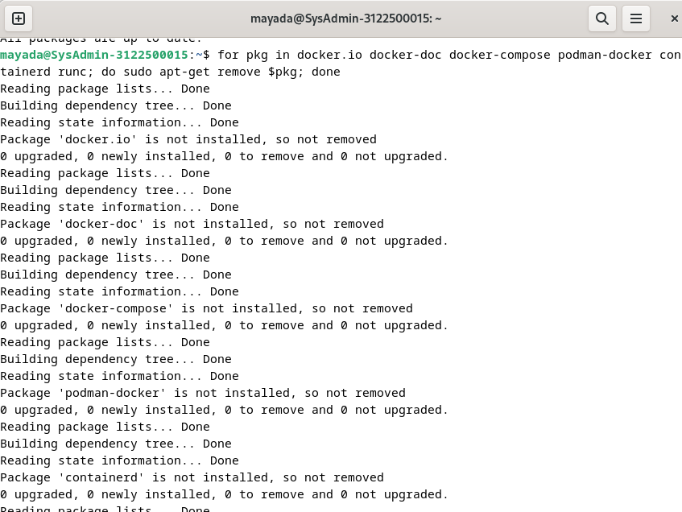
    

2. Tambahkan Docker's official GPG key

        sudo apt-get update
        sudo apt-get install ca-certificates curl
        sudo install -m 0755 -d /etc/apt/keyrings
        sudo curl -fsSL https://download.docker.com/linux/debian/gpg -o /etc/apt/keyrings/docker.asc
        sudo chmod a+r /etc/apt/keyrings/docker.asc

    

    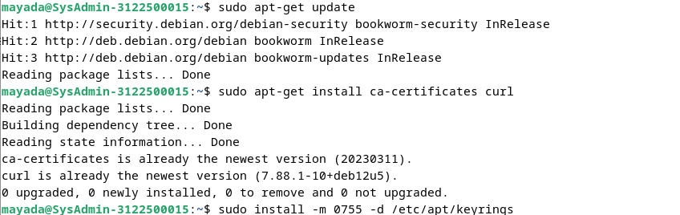
    

3. Tambahkan repositori ke Apt sources

         echo \
         "deb [arch=$(dpkg --print-architecture) signed-by=/etc apt/keyrings/docker.asc] https://download.docker.com/linux/debian \ 
         $(. /etc/os-release && echo "$VERSION_CODENAME") stable" | \
         sudo tee /etc/apt/sources.list.d/docker.list > /dev/null
         sudo apt-get update

    

    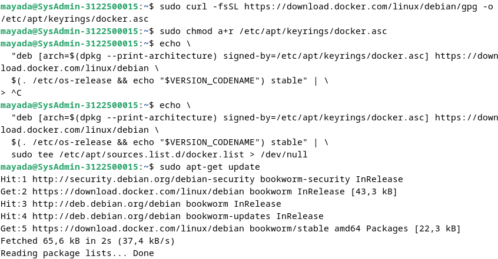
    

4. Install Docker Official Package

         sudo apt-get install docker-ce docker-ce-cli containerd.io docker-buildx-plugin docker-compose-plugin
    
    

    
    

        
5. Run a Container

        sudo docker run hello-world
    
    

    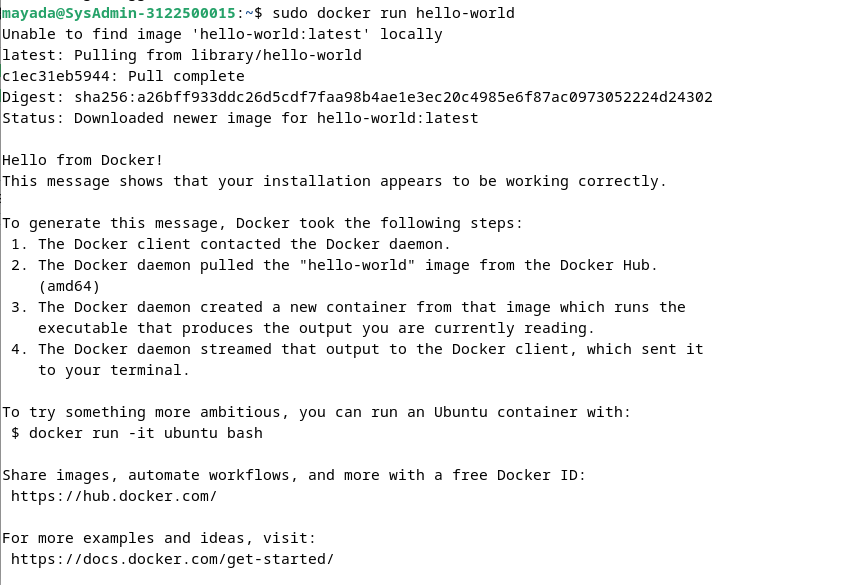
    

6. Coba Clone example hasil docker

        git clone https://github.com/alfiyansys/docker-examples.git
        docker build -t example .
        docker run -p 3000:80 example

    

    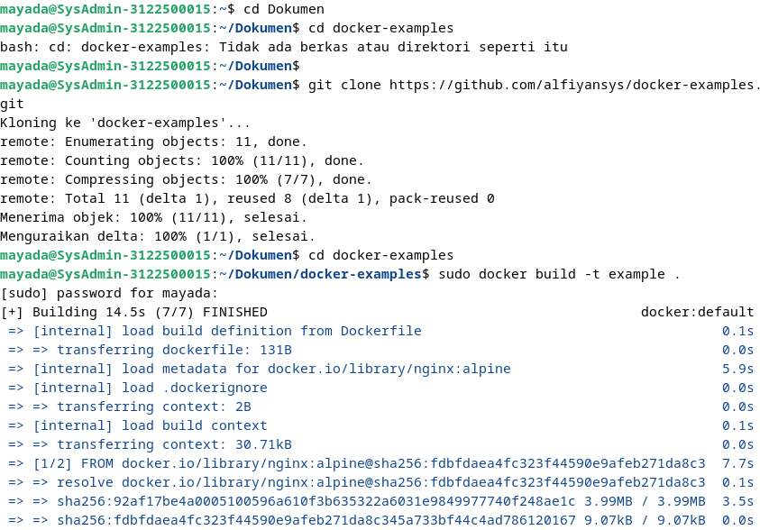
    

    

    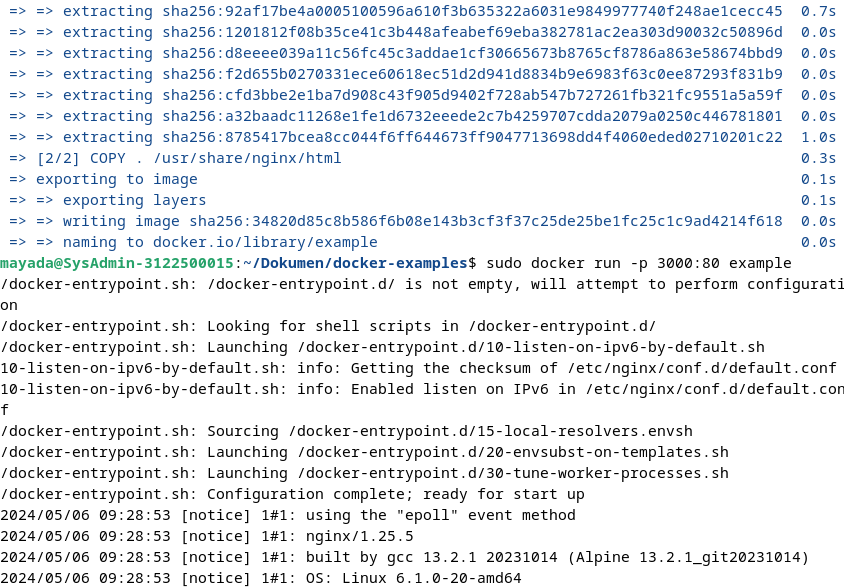
    

7. Open browser http://localhost:3000 dan lihat hasilnya

    

    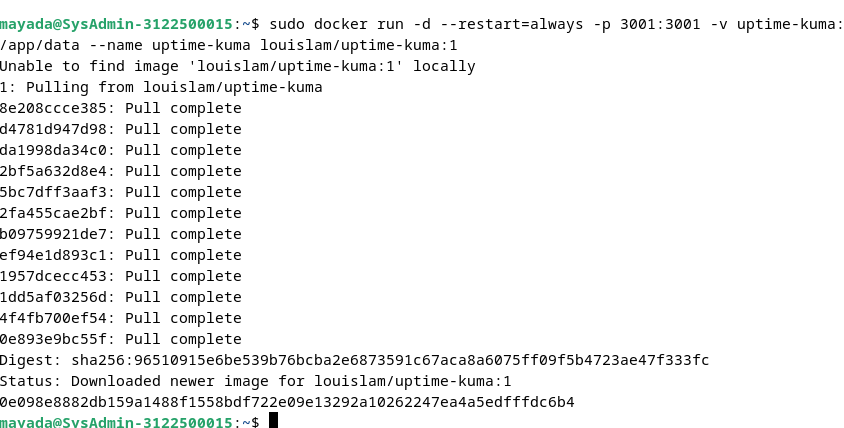
    

# 

## Apache2 + Dns Resolver + Docker Uptime Kuma Package

1. Git Clone Uptime Kuma

        git clone https://github.com/louislam/uptime-kuma.git
        cd uptime-kuma

2. Coba jalankan

        sudo docker compose up
        sudo docker ps -a

    

    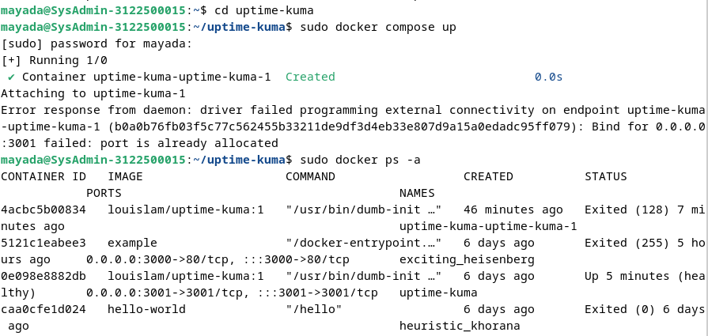
    

3. Cek pada port berjalan yaitu 3001
        
        localhost:3001

    

    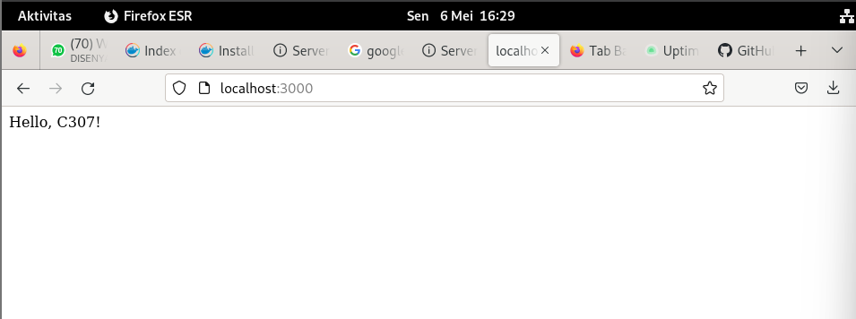
    

### Bagaimana jika menggunakan url monitoring.kelompok10.local saat mengaksesnya?

1. Konfigurasi file /var/lib/bind/db.kelompok10.local

    

    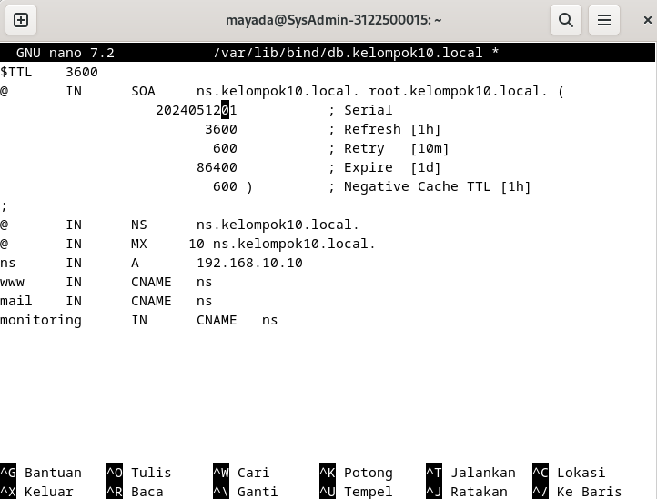
    

        sudo sytemctl restart named

2. Install beberapa Package berikut

        sudo a2enmod

    Masukkan Package berikut ``proxy proxy_ajp proxy_http rewrite deflate headers proxy_balancer proxy_connect proxy_html``

    

    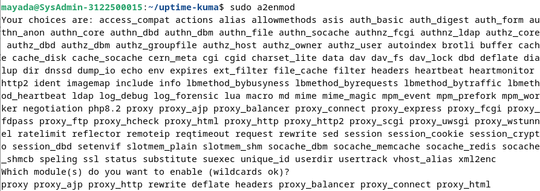
    

3. Lakukan Konfigurasi pada Apache2

        sudo nano /etc/apache2/sites-enabled/000-default.conf

    

    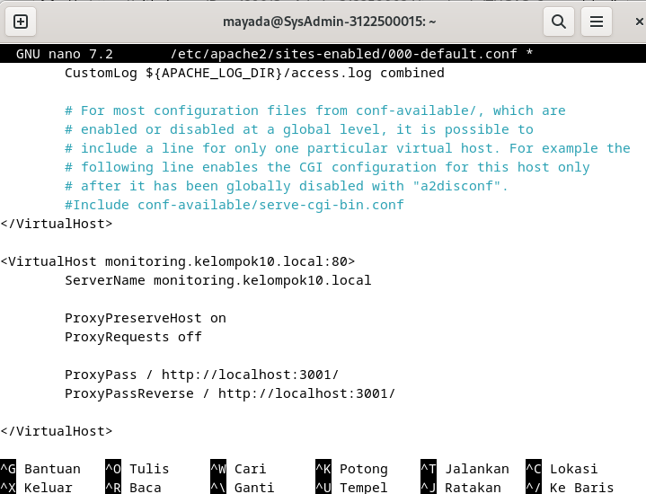
    

        sudo sytemctl restart apache2

4. Lakukan pengecekan pada web browser, dengan mengetikkan ``monitoring.kelompok10.local``

    

    
    

