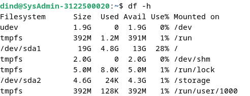
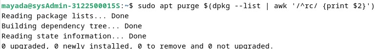

<h1 align="center">LAPORAN WORKSHOP ADMINISTRASI JARINGAN</h1>

<h3 align="center">PRAKTIKUM 3</h3>

<h4 align="center">Dosen Pembimbing: Dr. Ferry Astika Saputra ST, M.Sc</h4>

<p align="center"></p>

<div align="center">
  <h3>Disusun Oleh:</h3>
  <p align="center">Mayada Azizah 3122500015</p>
  <p align="center">Adinda Zahra Qariru 3122500020</p>
  <p align="center">Masyitha Fahra Nabila 3122500023</p>
</div>

<div align="center">
  <h3>PROGRAM STUDI TEKNIK INFORMATIKA <br>
      POLITEKNIK ELEKTRONIKA NEGERI SURABAYA <br>
      TAHUN 2023/2024 <br>
  </h3>
</div>

---
<br>

## Daftar Isi:
1. Cleaning the System
2. Installing external `.deb` packages
3. Membuat Subnet pada Mikrotik

---
<br>

<h1 align="center"> Cleaning the system </h1>

<p align="justify"> Meskipun kapasitas hard disk meningkat secara dramatis selama beberapa tahun terakhir, Anda mungkin membutuhkan beberapa ruang kosong. Beberapa skrip mengotomatisasi proses pembersihan disk. </p>

1. <b> Disk space information </b><br>
   Hal pertama yang harus dilakukan adalah mengetahui ruang yang digunakan pada disk Anda. Beberapa alat tersedia untuk Anda, mulai dari terminal Anda:
   - Ruang disk dalam mode terminal <br>
     Ringkasan penggunaan ruang disk untuk setiap titik pemasangan sistem (disk dan partisi) dengan perintah `df`:
     
   - Buat daftar repertori Anda yang diurutkan berdasarkan ukuran yang diperkecil <br>
     Tampilkan direktori Anda yang berat menggunakan `du` dan `sort`: <br>
     
   - `ncdu` <br>
     Sebuah analisis ruang disk dalam mode konsol. Untuk menjalankannya, cukup ketik `ncdu` di terminal Anda. Untuk menginstal perangkat lunak ini (dalam mode administrator): <br>
     
   - `baobab` <br>
     Sebuah analisis ruang disk dalam mode grafis, terintegrasi dalam Gnome tetapi tersedia dalam lingkungan lain dengan:
     

2. <b> Cleaning the packages </b>
   - `Apt/aptitude/dpkg` adalah pengelola paket Debian yang biasa digunakan. Saat Anda menginstal sebuah paket, berkas arsip-sumber/deb-nya disimpan di sistem Anda (di folder /var/cache/apt/archives/) untuk memungkinkan penginstalan ulang tanpa koneksi Internet. Untuk membersihkan "cache apt", gunakan perintah sederhana dalam mode administrator:
     ```
     apt clean
     ```
     
   - Setelah cache paket yang terinstal dibersihkan, Anda juga dapat menghapus paket-paket yang tidak berguna dari sistem Anda, serta file konfigurasi. Peringatan! Ingatlah untuk memeriksa dengan cermat daftar paket yang direncanakan untuk dihapus, sebelum menerima operasi tersebut:
     ```
     apt autoremove --purge
     ```
     
   - Jika Anda telah mengupgrade sistem Anda, mungkin ada beberapa paket yang tidak lagi tersedia di repositori baru: mereka sudah usang. Untuk menampilkan dan menghapus paket-paket ini, gunakan apt dan ingatlah untuk memeriksa dengan cermat daftar paket yang direncanakan untuk dihapus:
     ```
     list apt '?obsolete'
     apt remove '?obsolete'
     ```
     
     
   - Selanjutnya, untuk menampilkan dan membersihkan file konfigurasi yang tetap berada meskipun aplikasi telah dihapus, Anda dapat menggunakan perintah-perintah ini:
     ```
     dpkg --list | awk '/^rc/ {print $2}'
     apt purge $(dpkg --list | awl '/^rc/ {print $2}')
     ```
     
     
   - Bagi yang lebih peduli dengan kebersihan sistem, Anda dapat menginstal alat deborphan yang mencatat paket-paket di sistem Anda: yaitu, paket-paket yang tidak ada paket lain yang bergantung padanya. Peringatan! Ingatlah untuk memeriksa dengan cermat daftar paket yang direncanakan untuk dihapus, sebelum menerima operasi tersebut.
     ```
     apt install deborphan
     echo $(deborphan)
     apt autoremove --purge $(deborphan)
     ```
     
     
     

3. <b> Emptying the trash bins </b><br>
   Ada tiga tempat sampah yang berbeda yang harus diperhatikan:
   - Tempat sampah pengguna: `~/.local/share/Trash/`. Anda dapat mengosongkannya dengan dengan terminal:
     ```
     rm -Rf ~/.local/share/Trash/*
     ```
     
   - Tempat sampah administrator: `/root/.local/share/Trash/`. Untuk mengosongkannya dengan benar, gunakan terminal dalam mode administrator:
     ```
     rm -Rf /root/.local/share/Trash/*
     ```
     
   - Tempat sampah eksternal: terletak di disk eksternal Anda, biasanya dinamai `/media/y- our_id/your_disk/.Trash_1000`, di mana `your_id` sesuai dengan nama login Anda.

4. <b> Purging application caches </b>
   - Beberapa aplikasi menggunakan folder "cache", dimana mereka menyimpan gambar, video, dan informasi lainnya untuk berjalan lebih cepat. Biasanya data ini tidak menghabiskan terlalu banyak ruang disk, namun jika (dengan menggunakan alat yang dijelaskan di atas) Anda mendeteksi bahwa sebuah folder menjadi terlalu besar, jangan ragu untuk menghapusnya.
     ```
     rm -Rf ~/.chace/*
     ```
     
   - Setiap aplikasi memiliki cara tersendiri untuk mengelola cache-nya: beberapa menghapusnya secara sistematis saat mereka ditutup, yang lain menyimpan datanya di folder /tmp, yang akan dibersihkan saat logout sesi, yang lain menyimpan semua informasinya di folder tertentu.

5. <b> Purging the thumbnails </b><br>
   Masalah muncul ketika Anda menghapus sebuah file grafis, karena thumbnail-nya tetap disimpan dalam sistem, dan hal ini mengakibatkan sejumlah ruang disk terbuang untuk menyimpan thumbnail yang usang. Folder ini akan dibuat kembali saat sistem perlu menyimpan thumbnail yang baru dibuat. <br>
   ```
      rm -Rf ~/.thumbnails
   ```
   

---
<br>

<h1 align="center"> Installing external `.deb` packages </h1>

1. <b> Installation in graphic mode with GDebi </b>
   - Untuk menginstalnya, cari `gdebi` di manajer paket favorit (Synaptic, Discover, Software) atau lebih mudah lagi dari terminal dengan mode administrator menggunakan `su` (bab 3.8.3):
      ```
      apt update && apt install gdebi
      ```
      
    - Sekarang kita coba install paket dari Visual Studio Code <br>
      
    - Pastikan file ber-ekstensi `.deb` <br>
      
    - Selanjutnya buka "Package Installer", dalam menu klik File > Buka dan masukkan jalur file `.deb`. <br>
      
      
    - Kemudian klik "Pasang Paket". Password diminta untuk validasi instalasi. <br>
      
      
    - Paket akan dipasang <br>
      
    - Paket selesai dipasang <br>
      
    - Untuk menghapusnya cukup klik "Hapus Paket". <br>
      
      

2. <b> Installation in terminal mode with `Dpkg` </b><br>
   Dpkg adalah utilitas perangkat lunak yang menangani paket, seperti halnya apt, tetapi tanpa mengelola dependensi.
   - Buka terminal: <br>
     
   - Menginstal Paket Eksternal:
      ```
      dpkg -i nama_paket.deb
      ```
      
   - Pesan kesalahan akan memberi tahu jika ada dependensi yang hilang. Kemudian cukup instal dependensi tersebut dengan menggunakan apt:
      ```
      apt install dependensi_1 dependensi_2
      ```
   - Kemudian jalankan kembali instalasi paket eksternal:
      ```
      dpkg -l
      ```
      
   - Untuk menghapus paket eksternal:
      ```
      dpkg --purge nama_paket
      ```
      

##
<br>

<h1 align="center"> Membuat Subnet pada Mikrotik </h1>

1. Mulailah dengan membuka terminal pada komputer lab dan jalankan perintah ip addr.
2. Lakukan reset konfigurasi pada Mikrotik sampai alamat IP kembali menjadi 192.168.88.102.
3. Sambungkan kabel WLAN pada laptop Anda.
4. Pasang dan jalankan aplikasi Winbox pada laptop.
5. Hubungkan ke alamat fisik (MAC) yang ditampilkan di layar Winbox. Caranya adalah dengan mengklik alamat MAC tersebut dan kemudian klik "connect". Jika muncul pesan error, pilih opsi "legacy mode" di menu tools, dan coba lakukan koneksi kembali.
6. Ketika login ke Winbox, secara default terdapat konfigurasi bawaan dari pabrik. Sebaiknya, pilih opsi "Remove Configuration" untuk menghapus konfigurasi pabrik tersebut, agar dapat melakukan konfigurasi dari awal. Dengan demikian, konfigurasi dasar dapat dimulai dari awal.
7. Pertama-tama, untuk memeriksa level Mikrotik, cari menu "System" di sidebar dan pilih "License". Pastikan bahwa Mikrotik yang digunakan memiliki level 5.
8. Untuk menambahkan alamat IP, buka menu "IP" di sidebar dan pilih "Address List". Klik tanda plus berwarna biru di bagian atas kiri. Masukkan alamat IP 192.168.88.10/24, dengan network 192.168.88.0, dan interface di ether1.
9. Buka terminal baru dan jalankan perintah ping 192.168.88.254. Pastikan ping ke IP tersebut berhasil.
10. Buka menu "Bridge" dari sidebar dan klik tanda plus untuk menambahkan bridge baru. Beri nama 'bridge1' dan klik "apply".
11. Pindah ke tab "Ports", klik tanda plus. Setelah itu, pada bagian "Bridge Port", atur interface di ether2 dan Bridge di bridge1. Lakukan hal yang sama untuk ether3, ether4, dan ether5.
12. Tambahkan ether2 sebagai alamat baru. Masukkan alamat 192.168.10.1/24 dan network 192.168.10.0, lalu klik "apply".
13. Atur gateway dari menu "IP" di sidebar, pilih "Route", dan klik tanda plus untuk menambahkan route. Isi dengan destination address 0.0.0.0 dan gateway 192.168.88.254. Klik "apply" untuk menyimpan.
14. Atur DHCP dari menu "IP" di sidebar, pilih "DHCP Server". Pada bagian DHCP Setup, pilih bridge1 di DHCP Server Interface, dan ubah Set Addresses menjadi 192.168.10.200-192.168.10.254. Setelah selesai, simpan perubahan.
15. Buka menu "IP" dan pilih "DNS". Tambahkan DNS dengan alamat PENS, yaitu 202.9.85.4.
16. Terakhir, atur firewall dari menu "IP" di sidebar. Pilih "NAT" dan klik tanda plus. Masukkan source address 192.168.10.0/24 dan destination address 0.0.0.0. Klik "apply" untuk menyimpan.
17. Mikrotik sekarang telah terhubung dengan konfigurasi subnet yang baru.

## Topologi
